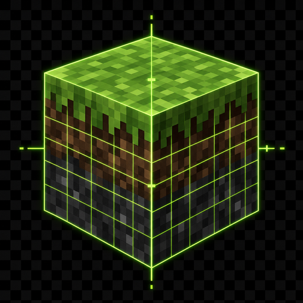

# old f3

<p align="center">
  
</p>

<p align="center">
  
  
</p>

---

`old f3` restores the dense pre-1.21.9 Minecraft debug screen layout for
Minecraft `1.21.10` on Fabric. press `F3` and the debug overlay stays focused
on the classic information layout instead of the newer customization surface.

## why

the newer debug screen is cleaner, but it is less useful if you are used to the
old dense layout. this mod keeps coordinates, chunk data, frame and tick
information, targeted block details, and runtime stats in one familiar overlay.

if you are searching for an old F3 screen mod, classic F3 debug HUD, Minecraft
1.21.10 F3 overlay, or Fabric debug screen restore, this is the small client-side
mod for that workflow.

## quickstart

1. download the latest jar from the [releases](https://github.com/Microck/old-f3-1.21.10/releases).
2. place it in your `.minecraft/mods` folder.
3. launch Minecraft `1.21.10` with Fabric.
4. press `F3`.

## compatibility

| requirement | version |
| --- | --- |
| Minecraft | `1.21.10` |
| Fabric Loader | `0.17.3` or newer |
| Fabric API | required |
| Java | `21` |

## behavior notes

- restores the classic debug overlay when pressing `F3`
- blocks the newer `F3 + F6` debug customization screen
- keeps the debug chart shortcuts visible in the overlay text
- omits one local difficulty line on `1.21.10` for stability

## build

build from source with the Gradle wrapper:

```bash
./gradlew build
```

the built mod jar is written to `build/libs/`.
